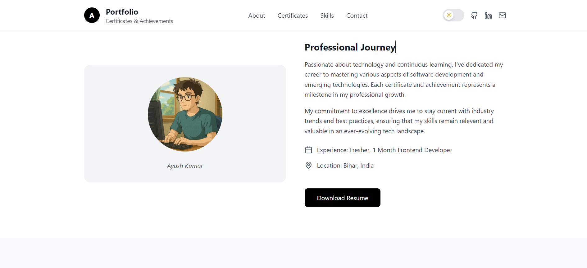
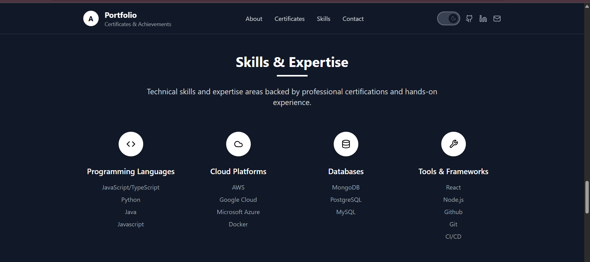

<div align="center">

# 🏆 Professional Portfolio - Certificates & Achievements



[](https://reactjs.org/)
[](https://www.typescriptlang.org/)
[](https://tailwindcss.com/)
[](https://vitejs.dev/)

**A stunning, production-ready portfolio website to showcase professional certifications, achievements, and expertise with a beautiful black & white theme and smooth animations.**

[🚀 Live Demo](#) • [📖 Documentation](#features) • [🛠️ Installation](#installation) • [🎨 Customization](#customization)

---

</div>

## ✨ Features

<table>
<tr>
<td width="50%">

### 🎨 **Design Excellence**
- **Minimalist B&W Theme** - Clean, professional aesthetic
- **Dark Mode Support** - Seamless theme switching
- **Responsive Design** - Perfect on all devices
- **Smooth Animations** - Engaging hover effects and transitions
- **Production Ready** - Optimized for performance

</td>
<td width="50%">

### 🚀 **Modern Technology**
- **React 18** - Latest React features
- **TypeScript** - Type-safe development
- **Tailwind CSS** - Utility-first styling
- **Vite** - Lightning-fast build tool
- **Lucide Icons** - Beautiful, consistent icons

</td>
</tr>
</table>

## 🖼️ Screenshots

<div align="center">

### 🌟 Hero Section


### 🏆 Certificates Showcase


### 🌙 Dark Mode


</div>

## 🚀 Quick Start

### Prerequisites

Make sure you have the following installed:
- **Node.js** (v18 or higher)
- **npm** or **yarn**

### Installation

```bash
# Clone the repository
git clone https://github.com/AyushSingh360/portfolio.git

# Navigate to project directory
cd professional-portfolio

# Install dependencies
npm install

# Start development server
npm run dev
```

🎉 **That's it!** Your portfolio will be running at `http://localhost:5173`

## 🛠️ Available Scripts

| Command | Description |
|---------|-------------|
| `npm run dev` | 🚀 Start development server |
| `npm run build` | 📦 Build for production |
| `npm run preview` | 👀 Preview production build |
| `npm run lint` | 🔍 Run ESLint |

## 🎨 Customization Guide

### 📝 Adding Your Certificates

1. **Navigate to** `src/components/Certificates.tsx`
2. **Update the certificates array** with your information:

```typescript
const certificates: Certificate[] = [
  {
    id: 1,
    title: "Your Certificate Title",
    issuer: "Issuing Organization",
    date: "2024",
    description: "Detailed description of what this certificate validates...",
    image: "/project/public/15.png",
    credentialId: "YOUR-CREDENTIAL-ID",
    verificationUrl: "https://verification-url.com"
  },
  // Add more certificates...
];
```

### 🎯 Personalizing Content

<details>
<summary><strong>📋 Personal Information</strong></summary>

**Hero Section** (`src/components/Hero.tsx`):
```typescript
// Update your name and title
<h1>Ayush Kumar</h1>
<p>Fresher</p>
```

**About Section** (`src/components/About.tsx`):
```typescript
// Update experience and location
<span>Experience: `` </span>
<span>Location: India, Bihar</span>
```

**Contact Information** (`src/components/Contact.tsx`):
```typescript
// Update contact details
<p>ayushsingh21109@gmail.com</p>
<p>+1 (555) 123-4567</p>
```

</details>

<details>
<summary><strong>🎨 Styling & Theme</strong></summary>

**Colors**: Modify `tailwind.config.js` for custom colors
**Animations**: Update animation classes in components
**Layout**: Adjust grid layouts and spacing in component files

</details>

<details>
<summary><strong>🔧 Skills & Expertise</strong></summary>

Update `src/components/Skills.tsx`:
```typescript
const skillCategories = [
  {
    title: "Your Skill Category",
    icon: <YourIcon size={24} />,
    skills: ["Skill 1", "Skill 2", "Skill 3"]
  }
];
```

</details>

## 📁 Project Structure

```
professional-portfolio/
├── 📁 public/
│   └── Images
├── 📁 src/
│   ├── 📁 components/
│   │   ├── About.tsx          # About section
│   │   ├── Certificates.tsx   # Certificates showcase
│   │   ├── Contact.tsx        # Contact information
│   │   ├── DarkModeToggle.tsx # Theme switcher
│   │   ├── Footer.tsx         # Footer component
│   │   ├── Header.tsx         # Navigation header
│   │   ├── Hero.tsx           # Hero section
│   │   └── Skills.tsx         # Skills showcase
│   ├── 📁 hooks/
│   │   └── useDarkMode.ts     # Dark mode logic
│   ├── App.tsx                # Main app component
│   ├── index.css              # Global styles
│   └── main.tsx               # App entry point
├── 📄 index.html
├── 📄 package.json
├── 📄 tailwind.config.js
├── 📄 tsconfig.json
└── 📄 vite.config.ts
```

## 🌟 Key Components

### 🏆 Certificate Modal System
- **Interactive Cards** - Click to view detailed information
- **Verification Links** - Direct links to credential verification
- **Responsive Design** - Perfect display on all screen sizes

### 🌙 Dark Mode Implementation
- **System Preference Detection** - Respects user's OS theme
- **Persistent Storage** - Remembers user's choice
- **Smooth Transitions** - Elegant theme switching animations

### 📱 Responsive Design
- **Mobile First** - Optimized for mobile devices
- **Flexible Grid** - Adapts to any screen size
- **Touch Friendly** - Perfect for mobile interactions

## 🚀 Deployment

### Netlify (Recommended)
```bash
# Build the project
npm run build

# Deploy to Netlify
# Drag and drop the 'dist' folder to Netlify
```

### Vercel
```bash
# Install Vercel CLI
npm i -g vercel

# Deploy
vercel --prod
```

### GitHub Pages
```bash
# Install gh-pages
npm install --save-dev gh-pages

# Add to package.json scripts
"deploy": "gh-pages -d dist"

# Deploy
npm run build && npm run deploy
```

## 🤝 Contributing

Contributions are welcome! Here's how you can help:

1. **🍴 Fork** the repository
2. **🌿 Create** a feature branch (`git checkout -b feature/amazing-feature`)
3. **💾 Commit** your changes (`git commit -m 'Add amazing feature'`)
4. **📤 Push** to the branch (`git push origin feature/amazing-feature`)
5. **🔄 Open** a Pull Request

## 📄 License

This project is licensed under the **MIT License** - see the [LICENSE](LICENSE) file for details.

## 🙏 Acknowledgments

- **React Team** - For the amazing React framework
- **Tailwind CSS** - For the utility-first CSS framework
- **Lucide** - For the beautiful icon set
- **Pexels** - For the high-quality stock images
- **Vite** - For the lightning-fast build tool

## 📞 Support

If you have any questions or need help customizing your portfolio:

- 📧 **Email**: ayushsingh21109@gmail.com
- 💬 **Issues**: [GitHub Issues](https://github.com/AyushSingh360/professional-portfolio/issues)
- ✨ **linkedin**: https://www.linkedin.com/in/ayushsingh360/
- ❤️ **LIVE**: https://portfolio-ashs-projects-0cd628f6.vercel.app/
---

<div align="center">

### 🌟 **Star this repository if it helped you!** 🌟

**Made with ❤️ and dedication to excellence**

[](https://github.com/AyushSingh360/portfolio/stargazers)
[](https://github.com/AyushSingh360/portfolio/network/members)

</div>
